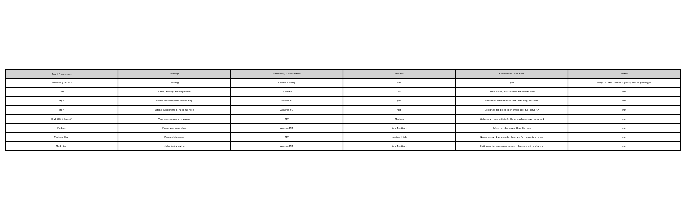
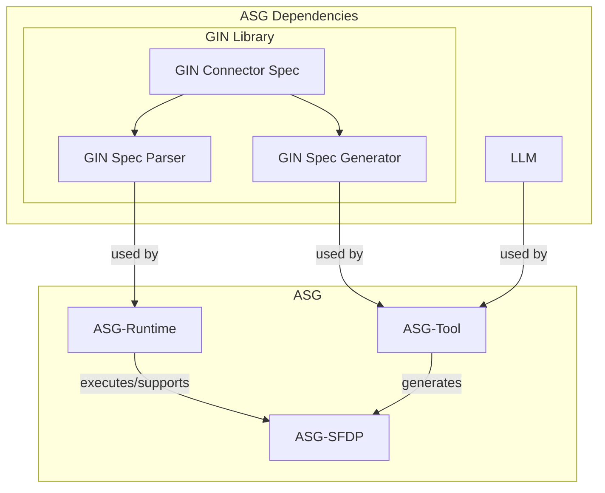
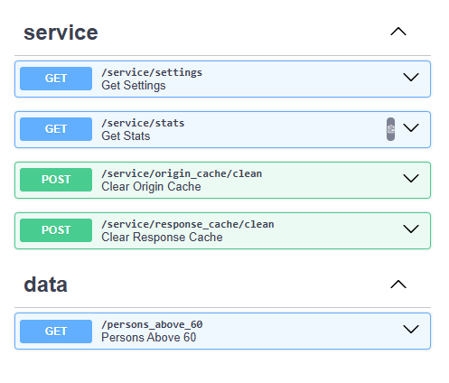
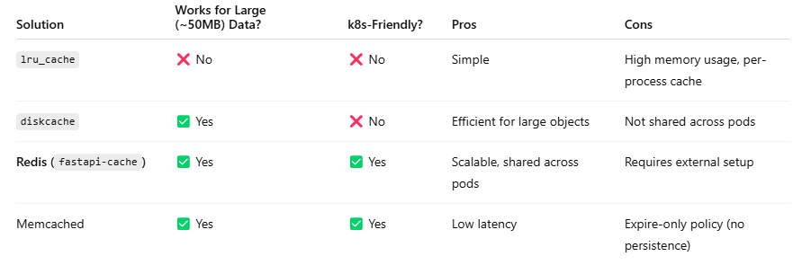
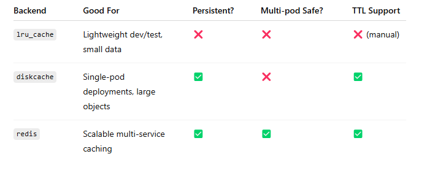
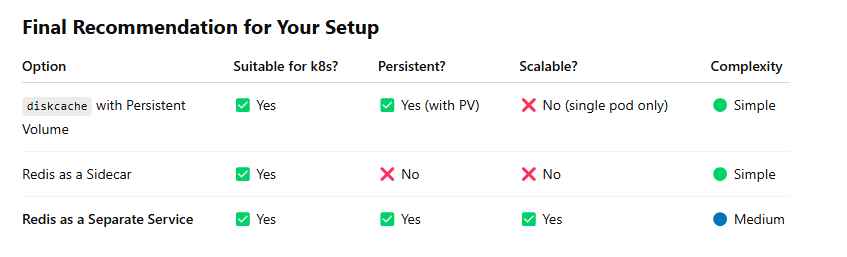
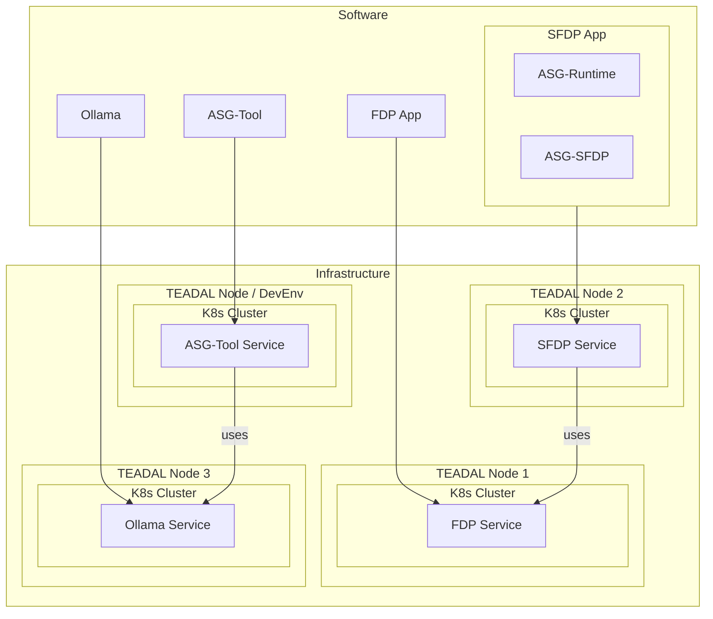

# D4.3 Stretched Date Lakes
---
> Final Report and Evaluation

## Executive Summary

The TEADAL project empowers organizations to securely collaborate on data-driven tasks across distributed infrastructures. It introduces a novel architecture for federated data sharing, allowing participating organizations to contribute, transform, and consume datasets without centralizing sensitive information. Key to this architecture is the concept of Federated Data Products (FDPs), which serve as shareable REST endpoints exposing organizational data, and Shared Federated Data Products (sFDPs), which enable re-exposure of FDPs under controlled conditions. This architecture is implemented using Kubernetes-based deployments and GitOps practices to maintain consistency and security across the federation.

This document reports on the work of **Work Package 4 (WP4)** within the TEADAL project. WP4 focuses specifically on realizing and managing cross-organizational data flows, originally conceptualized as "stretched data lakes" and evolved over time into a more modular and runtime-oriented architecture. The contributions described here include design, prototyping, and tooling that together allow federated data pipelines to be declaratively specified, consistently deployed, and programmatically observed. These results directly support the broader architectural goals of TEADAL and provide practical mechanisms to implement and govern data flows as part of shared infrastructures.

These are the main functional modules provided by WP4:
1.	AI-driven Performance Monitoring (AI-DPM) – a set of components responsible for collecting runtime operational data from nodes in TEADAL federation, including data on server performance and energy usage, analysing this data to create actionable insights such as predictions and alerts. Insights made available by these components are used by the control plane for selecting the most suitable deployment targets for the TEADAL data products.
2.	Automatic SFDP generation (ASG) – a set of components that assist developers in creating the Shared Federated Data Product (SFDP) to share data exposed by the existing Federated Data Product (FDP) according to an agreement achieved between the data provider and the data consumer. ASG relies on generative AI capabilities for selecting data transformations that need to be applied to the source datasets.  ASG is working as part of the SFDP creation flow facilitated through the TEADAL catalog capability, also briefly presented here for completeness. ASG also includes a runtime library for unified runtime execution and control of the generated SFDPs
3.	Control Plane – a set of components responsible for selecting deployment targets for the TEADAL data products at runtime and for deploying these data products. Deployment targets are selected among the TEADAL Nodes in the federation, based on the operational data and insights provided by the AI-based analytics as well as on the labels attached to the infrastructure to signify the capabilities of individual infrastructure components.

In addition to presenting these major components, the report describes their relationship with the components developed in other technical work packages (WP3 and WP5), their roles for use cases presented by the TEADAL pilots, and their planned contribution to the KPI validation to be performed in the final stage of the project, M34-M36, as part of WP6. 


## Introduction
According to the overarching TEADAL architecture (*todo: add references to WP2 deliverables*), **Federated Data Products (FDPs)** are owned and maintained by specific domains or teams within each organization participating in the TEADAL Federation. While this model respects data ownership and leverages domain expertise within individual organizations, directly exposing FDPs for cross-organizational sharing introduces challenges.

These challenges primarily concern two aspects:
- **Trust and privacy**, particularly across organizational boundaries between data owners and data consumers;
- **Efficiency and control** of infrastructure and data flow across the federation.

To address these limitations, the TEADAL architecture introduced the concept of **Shared Federated Data Products (SFDPs)**. An SFDP provides controlled access to underlying FDPs, operating under the governance of the TEADAL platform. This approach ensures that all aspects of the data-sharing agreement — including privacy, policy, and transformation requirements — are enforced at the interface level.

From project wide business-level perspective, the motivations behind the SFDP concept are:
- Facilitate internal data-sharing agreements without altering source systems;
- Provide versioning, governance, and traceability for reused data flows;
- Act as policy-compliant "middleware" between consumers and FDPs;
- Reduce time-to-data and development effort for data consumers.

At the work package level, we translate these motivations into a set of system-level objectives:
- Enforce data-sharing contracts at the API level;
- Apply required data transformations and policies before exposure;
- Preserve auditable boundaries between data ownership and consumption;
- Decouple consumers from the technical and semantic complexity of data sources;
- Represent transformed/contractual APIs as reusable, discoverable data products.

In this document, we present the final design and implementation of the key technical components supporting the SFDP concept in alignment with the TEADAL architecture. These components play integral role in the end-to-end FDP-to-SFDP production process: from SFDP negotiation and specification to its automated creation, deployment, and lifecycle management across the TEADAL Federation — all designed to meet both contractual and optimization objectives.

The document is structured as follows: 
- In section (STRETCHED DATA LAKES SUMMARY) we give an overview of the whole ...; 
- In Section (AI-DRIVEN PERFORMANCE MONITORING) we present the details on the monitoring subsystem of the TEADAL Control Plane 
- In Section (Automated SFDP Generation) we present the details on ...; 
- In Section (Control Plane) we iterate on the control plane aspects that were already presented in prior deliverables of this workpackage while refining them to be in line with the technology stack of the TEADAL Node in it finalized form
- In Section (summary) we summarize the contributions, outline the roadmap to impact, and present possible directions for future research


## Stretched Data Lakes Summary

While the concept of Shared Federated Data Products (SFDPs) was introduced to enable trusted cross-organizational data sharing, it also offers an opportunity to address the infrastructure-related challenges that would arise from exposing Federated Data Products (FDPs) directly. As part of our work on the TEADAL Stretched Data Lakes and its Control Plane, we have leveraged this opportunity to develop a complete toolchain for the creation and lifecycle management of SFDPs.

Our solution enables SFDPs to be implemented as lightweight, self-contained API services that act as controlled intermediaries between FDPs and their consumers. These SFDPs are generated using a templated application framework, backed by a shared runtime library. This approach facilitates rapid development, consistent deployment, and unified runtime management of SFDPs across the TEADAL Federation.

The benefits of this approach include:

- **Developer Efficiency**: Minimal boilerplate and low barrier to entry accelerate the creation of SFDPs.
- **Structural Uniformity**: All SFDPs follow a standardized layout and operational model.
- **Observability and Control**: Built-in instrumentation, caching, and transformation logic ensure robust monitoring and control.
- **Governability**: All interface and behavior definitions are derived from declarative specifications.

This unified lifecycle for SFDP generation and operation transforms them into advanced, policy-aware data pipelines. These pipelines:

- Retrieve data from source FDPs,
- Apply required transformations,
- Optionally cache raw and computed outputs,
- And expose the data to users under strict runtime policies and trust guarantees — the same guarantees that apply to FDPs.

To further enhance the operational capabilities of SFDPs and the TEADAL infrastructure at large, the platform integrates intelligent monitoring and optimization strategies. These are driven by rich runtime metadata and AI-based analysis pipelines. The AI-Driven Performance Monitoring (AI-DPM) framework presented in (section ref) complements the Stretched Data Lakes by enabling proactive resource management, anomaly detection, and performance prediction across the TEADAL Nodes — all critical to achieving the platform’s trust, sustainability, and efficiency goals. All of this operates under the control of the TEADAL Control Plane, which leverages smart telemetry, declarative policy, and dynamic optimization capabilities to select deployment targets for data products.


### Stretched Data Lakes in the TEADAL Architecture

*todo – briefly summarize the major functionality (data-driven performance/deployment management) and components, possibly with diagram*

#### Functional Responsibilities and Components

*todo – Stretched Data Lakes componentry is responsible for data-related infrastructure and operational enablement within the TEADAL architecture.*

- AIops
- ASG
- Control Plane

### Catalog Flows for SFDP Creation (CERFIEL)

*todo – Alessio to describe how the catalog supports the SFDP creation process, ideally with screenshots.*


### Stretched Data Lakes in the TEADAL Platform

TEADAL Platform (conceived at the architectural level in WP2 and realized in WP6) has been evolving throughout the project. At the time of writing this deliverable, the TEADAL Node exists as capable and production-ready platform ready to be installed and supporting a range of enabling technologies and services:
- **GitLab CI/CD and Argo CD** for GitOps-driven automation,
- **OPA (Open Policy Agent), Rego, and Keycloak** for fine-grained policy enforcement and secure identity management,
- **Prometheus, Thanos, Kepler, and Grafana** for federated observability and resource monitoring.

The Stretched Data Lakes components described here have been designed to be compatible with this curated TEADAL technology stack. Whenever feasible, they are integrated with the foundational services of the TEADAL Node. Some components, like for example the multi-cluster compiler and executor planned to become the base of the control plane, were created and demonstrated well before the TEADAL stack existed in its final form and thus are late to be fully integrated into the final project demonstrators. We plan to complete the integration at the extent possible till the end of the project and in scope required to support major use cases related to multi-cluster (multi- TEADAL Node) federations.   

*todo – Briefly summarize integration status of each component into the TEADAL Node (e.g., platform-infra vs. platform-apps, optional vs. required, dependencies, etc.), possibly using a diagram or a reference table.*

---

### Stretched Data Lakes Services for the TEADAL Pilots

The Stretched Data Lakes outcomes directly support several pilot use cases. Examples include:

*todo – Provide a table summarizing which pilots make use of which components, highlighting any pilot-specific extensions or adaptations.*


### Stretched Data Lakes and TEADAL KPIs

The Stretched Data Lakes outcomes directly support several TEADAL KPIs. Examples include:

1. **KPI 1.2 / KPI 1.3 — Data Product Adoption**  
   By monitoring the creation and usage of SFDPs across the federation, we gather insights into adoption trends and identify opportunities to foster reuse.

2. **KPI 3.1 / KPI 3.2 — Resource Efficiency**  
   Our telemetry system tracks storage and network usage for each SFDP, enabling automated or operator-guided decisions to optimize infrastructure use.

3. **Performance and Trust Constraints**  
   The SFDP deployment framework supports targeted placement strategies — for example, on GPU-enabled or TEE-secured nodes — allowing the system to meet application-specific performance or trust requirements.

## AI-Driven Performance Monitoring (skeleton only)
### AI-BASED PERFORMANCE MONITORING PROCESS
The approach
-	Introduction

Types of Metadata Collected
	 Resource Usage Metadata: recap from D4.2
 Energy Sustainability Metadata: We extended …
Infrastructure and Network Metadata: We extended…

Insights from metadata
-	Predictions and anomaly detection: recap from D4.1/D4.2

### AI MODELS

Classical AI Approach 
 AI models that have been experimented for
-	 Predictive Insights
-	Anomaly Detection

LLM Approach
We added an LLM approach to the traditional AI models for
-	Predictive Insights
-	Anomaly Detection
 
### ARCHITECTURE OVERVIEW

AI-DPM components
-	Thanos, algorithms, APIs, UI

AI-DPM Integration in TEADAL platform
 Prometheus and Thanos sidecar, Kepler, Istio

Data Collection, aggregation, storage and processing
-	How metadata are gathered/processed

### EXPERIMENTS AND RESULTS

AI models and machine learning cycle
training, testing, evaluation

Resource Usage Metadata
PoC recap from D4.2
Stressing resource usage with mubench
Simulated TEADAL Nodes experimentation environment

Energy Sustainability Metadata

Infrastructure and Network Metadata

### AI-DPM OUTPUTS

Rest APIs

Dashboard

Experimentation and visualization GUI


## Automated SFDP Generation (ASG)
The Automated SFDP Generation (ASG) subsystem is a key component of the TEADAL Stretched Data Lakes architecture and its control plane. It operationalizes the SFDP-based data sharing model proposed by TEADAL, transforming high-level sharing intents into uniform, policy-compliant, and deployable data services. As part of the TEADAL platform, ASG realizes:
- A developer-facing service for producing standardized SFDPs.
- A controller for SFDP execution integrated into TEADAL GitOps, catalog-driven data product and agreements management, and policy injection and enforcemet.

Innovation highlights:
- Declarative code generation using advanced generative AI technologies
- Unified runtime environment abstracting away low-level data access, processing and caching
- Transforms library supporting custom data transformations, including dynamic injection of their specific implementations
- Support for including deployment annotations (e.g., resource needs, TEE/GPU targeting)
- Support for runtime monitoring and observability via AI-backed analytics

Comparing with the alternatives:
- manual SFDP creation would require lots of deveveloper skill and effort, would be more time consuming and would result in inconsistent results and lack of code sharing bewtween the SFDPs 
- generic OpenAPI specification tools could be used to parse the SDFP spec, generate SFDP, and then also generate the SFDP app code. This could result in fragile and opaque code, possibly lacking semantic awareness of TEADAL specifics

This section provides the high level design of the ASG subsystem, starting with the overview of its technology choices and dependencies in (ref), the componentization and the high level design in (ref), and the implementation details in (ref).

### The ASG Dependencies and Technology Choices
TBD – few words to enter, talk about benefits of using LLMs for data management

#### The GIN Library
As was already presented in D4.2 [TBD - add reference], SFDP generation relies on the LLM-driven GIN library, developed in IBM Research and becoming widely used internally both for research and for contributing to the upcoming data management products. GIN library is made available to the TEADAL project team as a dependency, in form of a python package. 

the main exported constructs of GIN library relevant to this documents are:
- GIN Connector Specification - a set of pydantic models that cover internalization of every aspect of OpenAPI specification and a module that parses the standard OpenAPI specification files to fill in parts of GIN Connector Spec
- GIN Spec Generator - a module that generates the GIN Connector Specification for a given request
- GIN Spec Parser - a module that parses the GIN Connector Specification embeded into the generated SFDPs, producing the list of endpoints to fetch from the origin FDP and the list of transorms to apply to the fetched dataset to produce the result expected by the SFDP spec.
- GIN Executor - a module that takes in the parsed Connector Specification and executes it by: 1. fetching the origin data and 2. loading and applying the required data transformations.

Since its first presentation in D4.2, the library has been adapted, specifically for the TEADAL use case, to support autogenerating SFDPs using local inference endpoints with ollama (see details below) backed up by community models. 

#### Ollama Service
To avoid reliance on expensive or intermittently available cloud-based LLM services, we focused on enabling offline-compatible generation of SFDPs. For this, we first selected Ollama among all the options for the local model and inference serving [TBD - expand on local inference options, possibly with comparisin table including maturity, community, support, license, k8s-readiness etc.]. 
To support the generation of the Shared Federated Data Products without relying on expensive and not always available LLM services, we had to establish the possibility for offline usage of the GIN library. For this, we first selected **Ollama** among all the options for local model hosting and inference serving. Ollama stood out due to its ease of use, cross-platform support, and built-in model management. However, our decision was informed by a broader review of local inference options, summarized in the table below:

[Table X csv : Comparison of Local LLM Inference Options](tables/local_llm_options.csv)          


Each option was evaluated for its suitability in constrained, potentially air-gapped environments, as well as its compatibility with Kubernetes-based deployments. While more performant frameworks like **vLLM** and **TGI** offer production-grade scalability, they tend to have a steeper learning curve and more infrastructure requirements. **Ollama** offered a pragmatic middle ground, with a strong local-first philosophy, simple deployment using Docker, and an evolving ecosystem of compatible models.

Then, we have adapted the GIN library to be able to work with Ollama and have selected several models available in the community and capable of delivering the inference results required by GIN library. Namely, GIN library, which in-house uses the advanced `granite-code-instruct` models family, relies on model's ability to support tool calling and structured output. In TEADAL, we have adapted the compatible `granite-code` models family available in the Ollama Library (https://ollama.com/library). 

In addition, we have integrated the ollama service as part of the TEDAL Node, as app-level-service than can be enabled on any TEADAL Node. If enabled, the service can be also used for other inference jobs, both by additional TEADAL services and, in the future, by the data analytics workflow put together by federation partners and users. (todo – add reference to a platform integration section below)

#### Data Transformations Library
The data transformations library is, architecturally, one of the major building blocks of the FDP-to-SFDP pipelines. 

As part of ASG subsystem, the transforms library is one of the links between the SFDP generator and the runtime execution of the generated SFDP. First, the generator ‘understands’ the user provided specification of how SFDP should be derived from the FDP, ‘reads’ the descriptions of all the available transformations, and creates a plan of what transformations need to be applied and in what order. The generator then produces the spec (referred to as Gin Connector Specification) that is used at SFDP execution time to invoke the methods from the same library of transformations. So, for the generation step we basically need to only have the list of transforms with their descriptions, understandable by both the humans and by the LLMs, while at runtime we need to have the methods themselves ready to be loaded and executed. This link is facilitated by making the same transforms library available, both at the generation time and at the runtime. 

In a production system, we envision the transforms library to be a standalone component responsible for the full lifecycle of the transforms and their implementations. Such component, deployed separately, would be accessed by the ASG subsystem, both at SFDP generation and at the SFDP execution. In addition to storing the transforms and providing access to them to the ASG actors, the library component will take care of ingesting the transorms upon their creation and introduction to the system, validating them from a perspective of correctness, security, etc., collecting their runtime performance data, and decomissioning them when they are no longer required. Such a system could be also integrated with providers and consumers of transformation implementations through protocols such as MCP. Creating full-featured system like this is certainly beyond project resources and schedule but its very concetion is one of the valuable project outcomes.

For our prototyping and experimentation, we have created the simplest possible transforms library as a collection of python functions that can be applied to the FDP data at runtime to produce the results expected by the SFDP. Some of these functions are generic data manipulation functions like filter, rename, slice, etc., and are built-in to the system. Some functions can be added for specific FDP-SFDP pairs to implement the required domain specific functionality. Some other functions can be imposed by system operators to implement infrastructure-level functionalities such as, for example, compression and caching. Yet some other can even be dynamically adjusted to select the best possible implementation based on current system state, resources utilization etc. For example there can be several implementations of the `anonymization` function, each requiring different types and amouts of runtime resources. In this and other similar cases, the SFDP generator will list the generic `anonymization` step as part of transormations pipeline and the runtime system, based on where the service is deployed and what resources are available, will select the suitable implementation and inject it to the library instead of the generic `anonymization` placeholder. In general, this will be done based not only on resource availability but also on additional parameters the system is constraint by, e.g. the considerations of data friction, data gravity, and energy consumption (as modeled and implemented in WP3). In our prototype, the library is delivered as a folder with python files containing all the transform functions in the library. To differentiate general-purpose Python functions (e.g., helpers) from transformation-specific functions, GIN imposes the requirement to decorate the transforms with a special `make_tool` decorator that will help picking only the transform functions, both at generation and at execution. In our implementation, the fuctions are loaded dynamically while serving the SFDP data endpoints which supports injecting specific realizations of certain functions at runtime as explained above.

### The ASG High Level Design 
ASG is designed to realise the uniform approach to the SFDP generation and execution outlined in the Introduction (ref). Overall, the system pursues and realises the following design goals:
- Minimize developer effort required to stand up the SFDPs
- Ensure consistency across SFDPs via templated scaffolding
- Increase system mainainability by reducing the amount of custom code in the system
- Allow impoving resource usage through sharing runtime components such as data caches, transforms library, etc.

ASG achieves its goals through its three major components:
- The ASG-tool – a service for generating the SFDPs using LLM-backed GIN library
- The ASG-SFDP – a thin templated FastAPI server to be deployed on TEADAL infrastructure 
- The ASG-runtime – a library that backs-up the execution of the ASG- compliant SFDP servers, implementing all the heavy lifting: parsing the GIN connector Specification included in the SFDP; performing the http access to source FDPs; caching the data (with possibility of sharing among SFDPs deployed in the same environment); applying the transformation pipeline; error handling, etc., up to providing data to the SFDP endpoints at runtime.

Component Diagram: 


In what follows we describe each of these components in more detail.

#### ASG-tool

ASG-tool is a developer-facing command-line tool (that can be exposed as web interface) capable of generating SFDPs, using the following inputs:
- Information about the origin FDP, including its OpenApi specification, its active URLs deployed in the TEADAL Federations, as well as additional items required to access the data, e.g. auth keys.
- A minimal input spec defining the origin data source FDP and a set of endpoint configs that prescribe how endpoint's data is derived from the origin FDP data.
- A transformations library containing reusable data manipulation functions to choose from for deriving the SDFP data from the origin FDP data, e.g. built-in functions for reshaping, filtering, or aggregating the datasets.

ASG-tool outputs a working project (or repo) ready for validation and futher processing, including:
- A FastAPI implementation of the SFDP server, as `app.py` file that includes all the data endpoints described in the input specification. For each endpoint, the app includes a generated GIN Connector Specification to be parsed and worked through at runtime.  
- All the required boilerplate for standing up and testing the project locally, e.g. the requirements.txt, the README.md, etc., so the developer responsible for the SFDP can validate the generated SFDP is functioning up to the spec and is ready for onboarding and publishing. This step is nesesary to ensure validity of the generated services while reducing the overhead that would be required for creating SFDPs from stratch and ensuring uniformity of the resulting data products. In the future, when the technology matures, it'll be possible to include an automated validation step, to further reduce the need for human intervention.
- All the required boilerplate for creating a deployable image of the generated SFDP and pushing it to the TEADAL image registry, e.g. the Dockerfile and the CI workflow script to be enacted by the gitlab services as soon as the developer pushes the generated SFDP repo to the TEADAL's gitlab. In future production settings, the tool can be easily extended to support git integration, such as creating the remote repository and pushing the generated project artifacts thus triggering the CI workflow that will create and push new service's image. 

Once an SFDP is generated, the TEADAL Platform automates its deployment via the following further steps: 
- create yaml files for creating the required k8s resources
- create kustomize files for firing the argocd pipelines 
- create rego files for defining the policies related to the SFDP access
- optionally, annotate these artifacts with the runtime annotations, when for exapmle the SFDP can benefit from running on GPU nodes or require to be run in the trusted environments
- select the deployement target for the new SFDP, among the TEADAL Nodes existing in the Federation
- deploy the new SFDP on the selected deployement target and initiate its runtime monitoring. Given that all the deployment artifacts are ready and pushed to the gitlab repo backing the target TEADAL Node, this step can be implicitely automated due to a smart ArgoCD framework created by the TEADAL Platform team in WP6. Pushing to the gitlab repo of the Node will trigger the Node's argocd daemon to pull the artifact and stand up the app on its cluster.
- after the app is deployed, catalog should be notified to complete the SFDP creation flow by publishing the new data product and alerting the data consumer that have initiated the request for this new SFDP.

To summarize, the ASG-tool helps creating SFDPs as fully independent, policy-compliant, and version-controlled data services that are deployed like any other data products in the system, while being uniform and predictable by sharing the common template and the common, possibly shared, runtime services (e.g., caches, transform libarary instances, etc.).


#### ASG-SFDP
Each generated SFDP app:
- Lives in its own Git repo
- Embeds the generated connector spec and imported transformation logic
- Turned to a deployable image using the gitlab CI
- Deployed as a self-contained FastAPI service with:
    o	Clearly defined endpoints
    o	Stable response schemas
    o	Business logic applied transparently via the asg-library support

Ultimately, as part of the TEADAL platform, these apps are:
- Discoverable through the services catalog like other data products (FDPs).
- Deployable to TEADAL Nodes using existing practices the TEADAL Platform supports (k8s, argoCD, GitOps, etc.).
- Auditable thanks to versioned specs and centralized runtime behavior.
- Observable thanks to supporting service endpoints with stats and possibly telemetry postings (not yest implemented at the time of writing)

Figure xx below presents the in-app documentation page for an example ASG-SFDP, showing the service endpoints, common to all the SFDPs, and the data endpoints, specific for each individual SFDP, whereby the data can be obtained as specified by the contract and realized by the combination of GIN Connector specification, the transform library, the ASG-runtime library and its configuration prescribing the caching policy, the http client parameters, and more.

 


#### ASG-runtime

ASG-runtime is a library created to serve as a runtime dependency imported by every generated SFDP, with the following key responsibilities:

- Declarative Configuration, based on Pydantic Settings, including:
    - HTTP client behavior.
    - Caching strategies for origin and transformed data.
    - Serialization formats (e.g. orjson, msgpack, or noop).
    - Logging and observability options.
- Two Level Caching, one for the origin FDP datasets and one for the transformed datasets. Both layers are backend-flexible (support LRU, disk, Redis), serialization pluggable (support pickle and orjson), optional, and allow for triggered purging. Caching is implemented for optimizing the network usage and saving energy related to data transfer and transformations (and addressing project KPIs 3.2 and 3.3). 
- Transformation engine, dynamically loading the transforms library functions and executing them as specified in the GIN Connector specification of each endpoint.
- Observability support with built-in logging and statistics collection
    - http statistics
    - cache and serialization statistics
- Pluggability and Extensibility with modular design allowing introducing:
    - Custom serializers
    - Custom cache backends
    - Alternate rest client implementations if needed

The library is designed to be modular, versioned, easily testable, and geared toward configurability, observability and fault isolation. The library is packaged as versioned releases to ensure the generated SFDP and the runtime are created using the same version of their common dependencies (the GIN library components such as GIN Connector Spec models and the code for generated and parsing the spec). The packaging allows two ways of usage: 
- pulling the sources or the build release (archive) from git and importing it into the environment where the SFDP will run. This can be usefull for local testing by developers.
- using the base image that includes the asg-library for creating the SFDP image. this way is preferable for the automated image creation as it simplifies and speeds up image creation by eliminating the need to pull and build library sources every time SFDP image is created.

### Software Architecture
In this section we zoom into the lower level of abstraction and present how the ASG components are realised in software. All the code is written in python 3.12 and is available in TEADAL's gitlab.

#### ASG-tool

ASG-tool is implemented as a simple front end to the GIN connector generating module (GIN Spec Generator), adapted to the TEADAL use case. The additions are:
- a simple, OpenAPI-spec-like specification that describes the SFDP to be generated 
- a module that parses this SFDP spec to retrieve the list of data endpoints to be exposed by the generated SFDPs. For each endpoint, the code invokes the GIN generator to create the suitable GIN Connector Specification
- a FastAPI app template (jinja2) that is used as a basis for the resulting SFDP server app by creating the boilerplate (e.g., for the app initialization, hooking into the asg-runtme, service endpoints, etc.) of the app plus a placeholder for the required data endpoints, each to be filled in with the generated GIN Connector Specification
- generic artifacts to become part of the resulting SFDP project repo, e.g. the README.md, the requirements.txt, the Dockerfile, etc. 

For completeness, we briefly present the SFDP Specification Format used by the ASG-tool that contains only one top-level entry, `sfdp_endpoints`, that lists all the data endpoints that will be available in the generated SFDP. Each item in this list represents a specific data endpoint along with info about how it is derived from the data obtained from the source FDP.
The general structure of the specification file is as follows:
```yaml
sfdp_endpoints: 
    # the fist endpoint to be generated
    - <endpoint1-name>:
        fdp_path: < path to the endpoint in the source FDP >
        sfpd_path: < path to the endpoint in the generated SFDP >
        sfdp_endpoint_description: < String describing the generated SFDP endpoint >

        schema:
            # what will be returned by the generated endpoint
            <schema-name>:
                type: < object | ? >
                properties:
                    # the first 'column' in the return data
                    <property1-name>:
                        type: < string | integer | number | ? >
                        example: < example value >
                        description: < string describing the property >

                    # more properties can follow

    # more enpoints can follow
```

Each entry under `sfdp_endpoints` represents one data endpoint to be included in the generated SFDP, named as the entry itself. Each such entry is a dictionary with the following elements:

- `fdp_path`: This key is required and must contain a string representing the path to the corresponding endpoint existing in the source FDP. The string can contain placeholders for dynamic segments (e.g., `/stops/stop_id/{stop_id}`).

- `sfdp_path`: This key is required and must contain a string representing the path to the generated SFDP endpoint. It can mirror the placeholders in the source FDP path with similar placeholders (e.g., `/stop_id/{stop_id}`).

- `sfdp_endpoint_description`: This element is optional and can contain a string with the description of the generated SFDP endpoint. This is not required by the ASG tool and is used only as part of the OpenAPI specification of the generated SFDP, to help SFDP users by explaining the endpoints available from the generated SFDP.

- `schema`: This element is required and must contain a dictionary defining the schema for the data to be returned by the data endpoint. This disctionary describes the data properties along with their types and structures, as well as with the well-formed descriptions that will help GIN to derive the required data items from data exposed by the corresponding endpoint of the source FDP. The schema structure is a dictionary named as the data structure it describes, with the following keys:
	- `type`: (String) The type of the data described by the schema. It is usually object to indicate a structured dat object.

	- `properties`: A dictionary that defines the properties of the data described by the schema with type: object. Each property must contain name, type, and description, formatted as specified next. Each data element returned by the generated SFDP enpoint is specified as an entry in the properties dictionary. The entries are named as the data elements they specify and contain the following keys:
		- `type`: This key is required and must contain a string defining the data type for the property (e.g., integer, string).

		- `example`: This key is optional and can contain an example value for the property. This is not required by the ASG tool and is used only as part of the OpenAPI specification of the generated SFDP, to help SFDP users by illustrating a sample data value that conforms to the property's type.

		- `description`: This key is required and must contain a string describing this property. This is used by the GIN generator to derive the way this property can be constructed from the data exposed by the source FDP endpoint, namely to select the right set of transforms for the transforms library to be applied to the origin dataset.

#### ASG-runtime

ASG-runtime library is architected to ensure:
- Separation of concerns between the minimal templated FastAPI app that handles only the API layer and the bulk of SFDP functionality realised by the asg-runtime

- Reusability: By putting the main class into your library, you make it easy to reuse across services that differ only in source URLs or transformation logic.

- Maintainability:
Keeping cache backends and HTTP boilerplate in separate modules makes the system modular and easy to extend or test independently.

- Flexibility:
You can easily swap in new cache backends, plug in new data sources, or change transformation logic with minimal impact to the FastAPI app code.

In what follows we briefly describe indidual modules.

##### Settings Module
Settings mechanism is based on Pydantic v2 settings, allowing:
- Per-app customization to disable or enable the caches, to select the caching backend with its related parameters, to controll logging, http behaviour, etc.
- Loading from environment variables or .env files
- Validation and the earliest possible error reporting
- Derived properties compute the effective configuration, e.g., when to bypass response cache or use specific serializers
- Easy integration into Kubernetes, via ConfigMaps or Secrets 

The settings are loaded only once at SFDP app startup, from inside the library, and used for the system initialization. In production environments where this can be a limitation, dynamic reloading and reconfiguration can be implemented. In TEADAL Platform, the declarative k8s control plane can be relied upon to reload the SFDP (basically, restart the old pods and start up new ones) when configureation change is required. 

TBD - add snapshots of the settings

##### Caching Module

The caching module is extensible, with a BaseCache class defining the cache interface methods as well as a set ob abstract methods that are expected to be realized by each of the specific Cache Backends.

**Cache Backends**


**Cache Roles**
The dual-level approach to caching, supports two roles:
- Origin Cache stores raw data fetched from origin APIs and is also header-aware (respects ETag, Last-Modified if provided by the FDPs).
- Response Cache: stores transformed results for rapid repeated access, especially useful when original data is stable, but transformations are costly.
 
The origin cache and the response cache reuse the backend implementation but differ in how the compute the keys and how they decide on data revocation. 

For the response cache key, we hash the endpoint's GIN Connector Specification and cache the transormed and encoded response dataset. 

For the origin cache key, we hash all the available REST call parameters used to retrieve the data, namely, the url with its path elements, parameters,etc. In addition, we cache both the dataset received from the FDP and the http headers that are used to inform the FDP about the caching on next request so that new data is only retrieved when it was modified at the origin: 
- ETag (Entity Tag) → A unique hash that changes if the data changes.
- Last-Modified → A timestamp indicating when the resource was last updated.

When first fetching the data, we store the values returned in the ETag or the Last-Modified headers or both. When this dataset is requested again, we add data freshness validation headers to the request we send to the origin FDP:
- If-None-Match header when the ETag response header is available in the cache 
- If-Modified-Since header when the Last-Modified response header is available in the cache 

If the server responds with 304 Not Modified, we use the cached data, if the server responds with 200 OK, get the new data and update the cache.

Alternatively, we could implement sending a lightweight "Version Check" Request to the origin FDP. This could be more predictable if supported by all the FDPs, e.g. by implementing data versioning and a service endpoint to retrieve the version, e.g., https://{FDP-URL}/{FDP-ENDPOINT_WITH_PARAMS}/version. In production systems we recommend to implement this fucntionality across all the FDPs in the TEADAL Federation and rely on it to a cleaner origin caching.

Yet another alternative would be relying on TTL for refreshing the data but this would be more complex and even less predictable that the ETag/LastModified option. We recommend against relying on TTLs/SETEX for data freshness in production envioronmenst. 

Cache invalidation for removal of stale and unneeded data can rely on TTL and other eviction methods. We did not evaluate this aspect in the context of ASG-runtime.


**Supported Caching Backends**

✅ Flexible – Switch caching implementations easily.
✅ Maintainable – Decouples app logic from cache details.
✅ Future-proof – Can extend to other caches (e.g., Memcached, Cloud Caches).
ASG-runtime implements three different caching backends, the LRU, the diskcache, and the redis, and is designed to allow introducing additional backends if needed. Here is a brief comparison of several backends considered for implementation: 





```yaml
apiVersion: v1
kind: PersistentVolumeClaim
metadata:
  name: cache-pvc
spec:
  accessModes:
    - ReadWriteOnce
  resources:
    requests:
      storage: 1Gi

volumeMounts:
  - name: cache-storage
    mountPath: "/cache"
volumes:
  - name: cache-storage
    persistentVolumeClaim:
      claimName: cache-pvc

```

```yaml
apiVersion: apps/v1
kind: Deployment
metadata:
  name: redis
spec:
  replicas: 1
  selector:
    matchLabels:
      app: redis
  template:
    metadata:
      labels:
        app: redis
    spec:
      containers:
      - name: redis
        image: redis:latest
        ports:
        - containerPort: 6379
---
apiVersion: v1
kind: Service
metadata:
  name: redis-service
spec:
  selector:
    app: redis
  ports:
    - protocol: TCP
      port: 6379
      targetPort: 6379
```
Alternatively, redis can be deployed as side car together with the SFDP


**Multi-Tenant Redis Caching Strateg**y for Dynamic FastAPI Services
Since your FastAPI services will be dynamically created and removed, you need a multi-tenant caching approach that ensures:

Cache isolation – Each service stores its data separately.

Automatic cache cleanup – Stale cache entries should be removed when a service is no longer active.

1️⃣ Isolating Cache Data Between FastAPI Services
To prevent cache collisions, use namespacing by prefixing cache keys with the service name or a unique identifier. ✅ Each FastAPI service uses a unique cache namespace (SERVICE_NAME:cache_key).

2️⃣ Handling Stale Cache Data When Services Are Removed
Since services are dynamically created and deleted, you need a way to automatically remove stale cache entries when a service is no longer active.

Options for Cleaning Up Stale Cache Data:
🔹 Option 1: Use Expiry (SETEX or TTL)
Set a time-to-live (TTL) on all cache entries when they are created. This ensures stale data is removed automatically.
✅ Pros: Simple, automatic.
❌ Cons: Data may persist longer than needed if a service is removed.

🔹 Option 2: Use a Background Job for Cleanup
Periodically scan Redis to find keys associated with obsolete services and delete them.

Example using a background FastAPI task to clean stale entries:
✅ Pros: Ensures unused cache data is removed.
❌ Cons: Requires tracking active services dynamically.

🔹 Option 3: Use Redis Key Expiry Events (Advanced)
Redis supports keyspace notifications (notify-keyspace-events) to track expired keys and trigger cleanup logic.

Example: Configure Redis to notify when keys expire:

sh
Copy
Edit
redis-cli config set notify-keyspace-events Ex
Then, use a Redis subscriber to monitor expired keys and clean related data.

✅ Pros: Automated cleanup.
❌ Cons: Requires additional Redis event handling.

---
📊 Telemetry & Cache Usage Reporting
In the fastapi_rest_cache/telemetry/stats.py module, you can implement a simple in-memory or persistent stats tracker (optionally backed by Redis).

Example responsibilities:

Count hits/misses

Track bytes cached vs retrieved

Report via a /metrics endpoint or log export

Example structure:
---
✅ The Executor as Master/Manager (Singleton-like)
Responsibilities:

Manages lifecycle and access to:

Shared caches

Global settings

Runtime stats / observability

Logging / tracing

Delegates data retrieval & transformation to per-request Driver objects

Usage:

Initialized once (per app instance), typically during FastAPI startup

Injected into routes or used as a shared module/global

This is like having a service object in classic design patterns. In a web context, this gives separation of concerns and clarity, especially as the system grows.
Executor abstraction: Central coordinator of caching, fetching, and transformation logic, aware of app config and serializer choices.
Executor: The Core Orchestrator
Handles:
Settings validation.
Instantiating caches, fetchers, and serializers.
Coordinating fetch-transform-respond logic per endpoint.
Acts as a lifespan-injected app context, ensuring initialization is centralized and robust.

---
✅ The Driver per Request
Responsibilities:

Encapsulates all logic needed for a single request:

Target origin (FDP) endpoint and any query parameters

The transformation pipeline for the data

Custom cache key generation for this slice of data

Fetches from cache or source as needed, performs transformation, returns data

Why it works:

Keeps the Executor thin and stateless across requests

Allows each FastAPI route to instantiate a customized driver per invocation

Encourages code reuse and testing: you can test driver behavior in isolation


---
🔌 Fetcher & Transformer
OriginFetcher: handles:
Data fetching via HTTP.
Integration with origin cache.
Multi-endpoint fetching logic.
Transformer: receives structured origin data and applies the correct chain of transformation functions (from the imported library) before returning the result.
Experimental hooks (e.g., telemetry or auth) through wrapper decorators.
OriginFetcher.fetch() is fully async.

It tries to optimize bandwidth by leveraging:

ETag (If server supports it).

Last-Modified (If server supports it).

Resilient: falls back to cached value on timeout or network error.

Stateless and reusable for multiple keys/URLs.
Exponential backoff: we multiply the base backoff by the attempt number.

Graceful fallback: when all retries fail, we try to use cached data if available.

Customizable retry logic: if needed, you can expose retryable status codes or add jitter.


3. Generated SFDP Apps


### Operational Aspects


At the time of writing, ASG-tool is provided as a command line utility that imports GIN modules as dependency and relies on Ollama service deployed on TEADAL as a driver for the genetrative AI capabilities of GIN. We plan to enchance the tool itself to be deployed as TEADAL platform service as part of TEADAL Node and to expose a web interface in addition to CLI. Additional possible enchancement, as already mentioned above, is to integrate git repo creation and pushing. 

How This Works
App Initialization: The FastAPI app initializes with the settings and creates an instance of Executor to manage caching and data fetching logic.

Endpoint Logic: Each endpoint in the FastAPI app uses Depends to call executor.get_data(). This method internally creates a DataRequestDriver instance to handle the specifics of the request (e.g., fetching data, transforming it).

DataRequestDriver: For each request, a fresh DataRequestDriver instance is created. It handles fetching the raw data, applying transformations, and using the appropriate caching mechanism.

Conclusion
With this structure:

The app code remains minimal, only knowing about the Executor and settings.

The Executor is responsible for creating a DataRequestDriver per request.

The app is unaware of the inner workings of data retrieval or transformations.

Would you like to proceed with this setup?

High-Level Flow:
DataRequestDriver Initialization:

The get_data method in the Executor will initialize the DataRequestDriver. The DataRequestDriver will be responsible for parsing the request spec, fetching data, and handling transformations.

Result Cache Interaction:

The Executor will first check if the transformed data is already available in the result cache (this would be a simple cache lookup).

If found, return it directly with an update to cache stats (e.g., cache hit).

If not found, it moves to the next step of fetching the required data.

Origin Cache Lookup:

The DataRequestDriver will check whether the origin data is available in the origin cache.

If any origin data is missing from the cache, it will be fetched from the origin via the HTTP client.

Data Transformation:

Once all data from the origin is retrieved (either from cache or fresh), the necessary transformations will be applied.

The transformed data is then returned to the Executor to be cached (in the result cache).

Returning the Result:

The transformed and cached data is returned to the FastAPI app to be encoded (e.g., as a JSON response) and sent to the user.

Selecting what to cache, the original data or the transformed data, or both, depends on the nature of the origin and the transformed datasets transformation, the network availability, the storage availability, the policy and additional system constraints. If the transformation is lightweight, e.g., simple filtering, renaming fields, the FDP data is stable (static) and newtork bandwith is scarce, then caching the origin data and recomputing the transformation for each SFDP request can be the best solution. Same applies if the origin data is stable but the transformations are expected to be dynamic (injected for runtime loading and execution). On the other hand, when the transformations are stable but computationally expensive, e.g. e.g., encryption, heavy filtering, aggregation, or when the computed dataset is significatly smaller than the origin dataset and storage is scarce, it might be better to cache the response data. In cases the origin FDP data is very dynamic, caching should be disabled, while in some other cases enabling both caches can benefit the system. In current implementation, caching is enabled per SFDP instance and is applied across all the endpoints. For production systems, the implementation can be easily adapted to make separate decision per endpont.
#### Lifecycle and Deployment Flow
SFDP creation → validation → enrichment → deployment → monitoring.
Catalog entries and GitOps repositories as authoritative sources.
Runtime controller (in progress) to manage state and redeployments.
Annotations supported for deployment-time optimization (e.g., GPU requirements).
Runtime observability pipeline feeding into smart monitoring dashboards.

#### Platform Integration
Federation Nodes:
Uniform k8s base image, supports Istio, ArgoCD, Redis, etc.
SFDPs run in isolated containers, using runtime-provided Redis and storage layers.
Catalog-aware annotations and lifecycle management.
Support for in-node policy enforcement and runtime alerts.
Deployement diagram:


    

#### Example Scenario: From Spec to Deployed SFDP
(Optional but illustrative: a diagram or short walkthrough)
Dev writes spec → uses asg-tool → gets app → enriches → deployed → monitored.

## Control Plane Updates
TBD

## Summary

9. Future Work
Runtime-as-a-Service for automated SFDP babysitting.

Transformation libraries as shared federated services.

Optimization engine for intelligent SFDP placement (GPU/TEE).

Deduplication and result caching across SFDPs.

Dynamic configuration reloading without redeployment.

Cross-node SFDP invocation chaining (composable SFDPs).

10. Conclusion
ASG brings automation, standardization, and governance to SFDP development.

It simplifies the lifecycle, reduces developer toil, and ensures policy alignment.

Embedded deeply into the Data Sharing Federation platform, it serves as a cornerstone of federated data reuse at scale.

WP4 infrastructure has potential alignment with the **MCP (Multi-Cluster Platform)** trend, where decentralized deployment and control of software components across federated clusters is becoming increasingly important. TEADAL’s GitOps-driven approach to federation may serve as a reference model or early prototype of MCP-aligned architectures.

## backup

1. why we want SFDPs to sit between the data users and the FDPs provided by the data owners (to ensure business contracts etc, trust to you to expand it here) 
1. why we decided to support autogenerating these SFDPs to be small templatable  apps supported by rich runtime (dev time and skils, uniformity, etc, expand here as well as you like). After explaining this story, outline the three main assets that are created without expanding too much (each will be zoomed in subsections: 
	1. the asg-tool (to generate SFDP from template + user provided input spec + transfroms library; the tool will be available for the developers to invoke and create the working app project folder or repo, the app will contain the generated runtime 'connector spec' that will be then parsed and executed by the asg-runtime) 
	2. the asg-library to support the generated app at runtime and 
	3. the generated apps themselves that will live in their own repos and will be first validated for deployment and then deployed to the production environment and made discoverable through services catalog like other data products. So in short, can you produce this document structure with the intro and the subsections where each of the 3 assets are described, focusing on asg-library for now

1. Executive Summary
Brief overview of the Data Sharing Federation (DSF) platform.
Strategic motivation for automatic generation of Shared Federated Data Products (SFDPs).
Overview of the ASG subsystem and its role in the federation.

2. Background and Motivation
The Federation Challenge: Need for scalable, trustworthy, and compliant data sharing between organizations.
FDPs and SFDPs: Distinction between original Federated Data Products (from data owners) and Shared FDPs (created for consumer-oriented reuse).

3. ASG: Automatic SFDP Generation Subsystem
Role of ASG within the DSF platform:

A developer-facing service for producing standardized SFDPs.
Enabler for CI/CD integration, catalog-driven deployment, and policy injection.
Innovation highlights:
Declarative spec-driven code generation.
Unified runtime environment abstracting away low-level data access and caching.
Support for future deployment annotations (e.g., resource needs, TEE/GPU targeting).
Integrated runtime monitoring and self-observation via AI-backed analytics.

4. Key Components
4.1. ASG-Tool
4.2. ASG-Runtime (Library)
Runtime dependency shipped with every generated SFDP.
Key responsibilities:
Settings & lifecycle management: Centralized Pydantic models, logging setup, observability hooks.
Origin fetching: Robust, async HTTP fetcher with transparent caching.
Cache orchestration: Dual-level cache support (origin & response), pluggable backends, serializer strategy.
Transformation engine: Injected at runtime, executing user-provided transformation chain over structured results.
Executor abstraction: Central coordinator of caching, fetching, and transformation logic, aware of app config and serializer choices.
Modular, easily testable, and geared toward observability and fault isolation.

4.3. Generated SFDP Applications
Each SFDP is an independent deployable app.
Stored in its own Git repository with full project structure.
Production-readiness steps:
Initial validation & enrichment (e.g., policy files, deployment manifests).
GitOps-controlled deployment using platform automation services.
Discoverable via the Federation Data Catalog, alongside native FDPs.


Let me know if you'd like:

Any visual diagrams (e.g., lifecycle flow, component architecture).

A ready-to-download .docx version.

A more formal rewrite of the above into narrative prose.

You’ve already done the hard part—now we just wrap it in gold foil ✨


4.2	SFDP DEPLOYMENT
TBD explain how the fully specified SFDP is getting deployed
- Selecting the deployment target, based on data in ADP-M and infrastructure labels, e.g., related to the trust framework (CYB, Martel) 
- Deploying the SFDP to production (gitops, controller)
4.3	SFDP EXECUTION
The Runtime Transformations Library
TBD – explain how runtime choice of the selected transformations are made
The Executor Component 
TBD – describe the design and the implementation of the executor and how it is used by the generated SFDPs
5.	SUMMARY (IBM)
TBD – summarize the document
