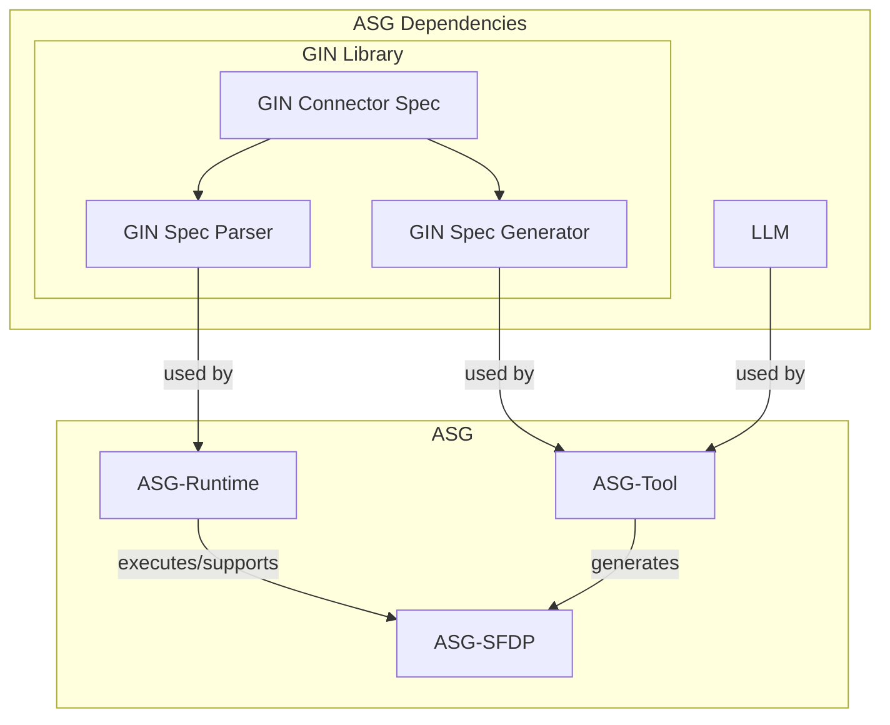

```mermaid
graph TD
    subgraph dep[ASG Dependencies]
        llm[LLM]
        subgraph gin[GIN Library]
            gin_spec[GIN Connector Spec]
            gin_parse[GIN Spec Parser]
            gin_gen[GIN Spec Generator]
            gin_spec --> gin_parse
            gin_spec --> gin_gen
        end
    end

    subgraph asg[ASG]
        asg_tool[ASG-Tool]
        asg_rt[ASG-Runtime]
        asg_sfdp[ASG-SFDP]
        asg_tool --> | generates | asg_sfdp
        asg_rt -->  | executes/supports | asg_sfdp        
    end

    gin_gen --> | used by | asg_tool
    llm --> | used by | asg_tool
    gin_parse -->  | used by | asg_rt
    
```